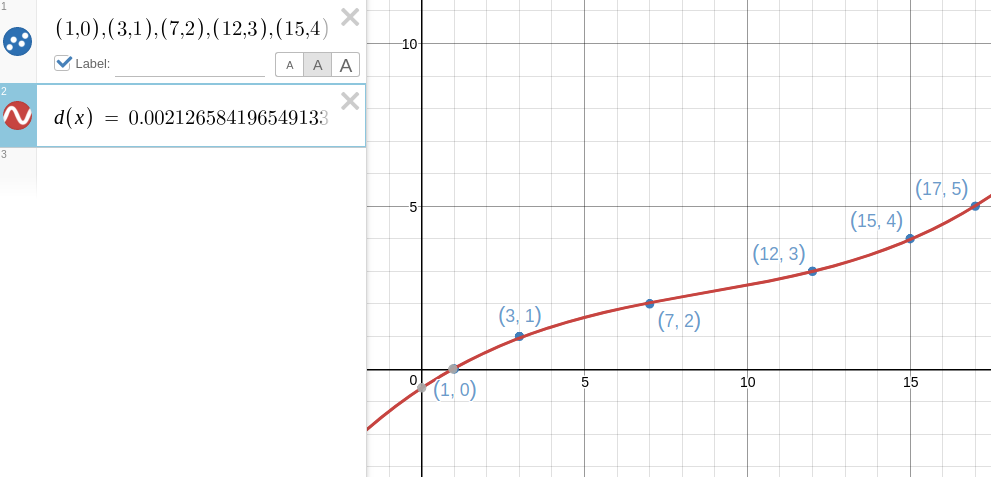
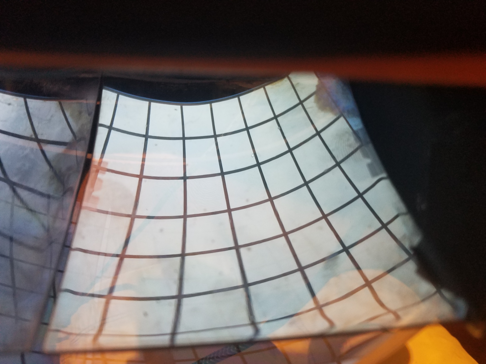
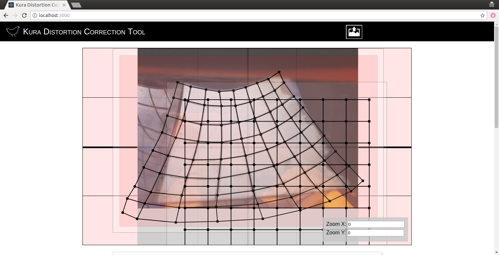
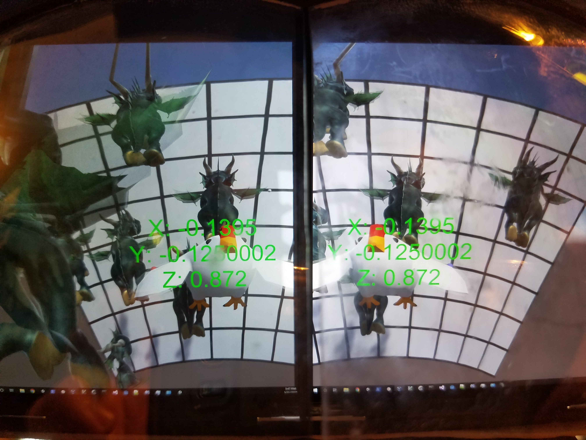

# Kura Distortion Correction Tool

### Overview
The main idea of this is to take a picture of a checkerboard viewed through the hmd, align points to the points of the distorted checkerboard, use regression analysis to find the equation mapping the points of the distorted checkerboard to the orriginal.  Then this equation can be used to correct for the distortion in real time.  
Since we are currently using Unity for the demo, we can plug in the equation to the shader to correct the distortion.

This was created using [reactjs create-react-app](https://github.com/facebook/create-react-app)


### Approach

Given a known set of points, and the same points passed through some distortion function d(x, y) => (dx, dy), find the inverse of the function such that d<sup>-1</sup>(dx, dy) => (x, y).  so by applying the inverse of the distortion function to the distorted points, you get back the original points d<sup>-1</sup>(d(x, y)) => (x, y)

## 1d example
It's easier to tackle a 1d example to see how this all works.

Given:
```
x = [0,1,2,3,4,5]
dx = [1,3,7,12,15,17]

d(x) = dx

d⁻¹(dx) = x

find d⁻¹(x)
```
Using python's numpy.polyfit, the function is
```
np.polyfit(dx, x, 3)
d⁻¹(dx) = 0.0021265841965491337*x^3 + -0.05549427441805268*x^2 + 0.6578571486231924*x^1 + -0.5802630776812817
```

Now it can be applied on the distorted points to get the non distorted ones.
```
d⁻¹(1) = 0
d⁻¹(7) = 2
d⁻¹(5) = 1.587
```
...etc.



Then for the distorted image you would just use 2 dimensions.
```
d(x, y) => (dx, dy)
d⁻¹(dx, dy) => (x, y)

dₓ⁻¹(dx, dy) => x
dᵧ⁻¹(dx, dy) => y
```


## Steps
1. Start the web server `npm run start` and open it in your browser [http://localhost:3000]
2. Click the upload image button at the top and select an image of the distorted grid
3. Move and resize the image, grid points, and resize and adjust zoom of background axis to the desired values in order to maximize accuracy and ease of use
4. Move each point to their corresponding positions in the image
5. Click the download button to get the python code script
6. Run the calc tool on the downloaded python script
```
mv ~/Downloads/distortion_input_data.py /path/to/calc.py/dir/
cd /path/to/calc.py/dir/
python3 calc.py distortion_input_data.py
```
7. Copy the output equation to the unity shader (or where ever it should go)


## calc.py

Calculates the distortion correction polynomial equation given input and output point sets.


### Use:
```
import calc
kdc = calc.KuraDistortionCalculator()

trainIn = [
    [0, 0], [0, 1],
    [1, 0], [1, 1]
]

trainOut = [
    [0, 0], [0, 2],
    [2, 0], [1, 1]
]

kdc.calculate(trainIn, trainOut, 2)

```
output:
```
xo = 1.1102230246251565e-15 + x * 0.9999999999999992 + y * -7.771561172376096e-16 + x * x * 0.9999999999999987 + x * y * -0.9999999999999969 + y * y * -8.881784197001252e-16

yo = -7.771561172376096e-16 + x * 8.881784197001252e-16 + y * 1.0000000000000009 + x * x * 4.996003610813204e-16 + x * y * -1.0000000000000036 + y * y * 1.000000000000001

```

#### CLI

python3 calc.py DATA_FILE.py


## Example

#### Grid image:


#### Distorted grid image:


#### App points:


#### distortion_input_data.py

```
trainIn = [
    [-1.903, 1.4763], [-1.4356, 1.4763], [-0.9681, 1.4763], [-0.5007, 1.4763], [-0.0333, 1.4763], [0.4341, 1.4763], [0.9015, 1.4763], [1.3689, 1.4763], [1.8363, 1.4763],
    [-1.903, 1.0356], [-1.4356, 1.0356], [-0.9681, 1.0356], [-0.5007, 1.0356], [-0.0333, 1.0356], [0.4341, 1.0356], [0.9015, 1.0356], [1.3689, 1.0356], [1.8363, 1.0356],
    [-1.903, 0.5948], [-1.4356, 0.5948], [-0.9681, 0.5948], [-0.5007, 0.5948], [-0.0333, 0.5948], [0.4341, 0.5948], [0.9015, 0.5948], [1.3689, 0.5948], [1.8363, 0.5948],
    [-1.903, 0.1541], [-1.4356, 0.1541], [-0.9681, 0.1541], [-0.5007, 0.1541], [-0.0333, 0.1541], [0.4341, 0.1541], [0.9015, 0.1541], [1.3689, 0.1541], [1.8363, 0.1541],
    [-1.903, -0.2867], [-1.4356, -0.2867], [-0.9681, -0.2867], [-0.5007, -0.2867], [-0.0333, -0.2867], [0.4341, -0.2867], [0.9015, -0.2867], [1.3689, -0.2867], [1.8363, -0.2867],
    [-1.903, -0.7274], [-1.4356, -0.7274], [-0.9681, -0.7274], [-0.5007, -0.7274], [-0.0333, -0.7274], [0.4341, -0.7274], [0.9015, -0.7274], [1.3689, -0.7274], [1.8363, -0.7274],
    [-1.903, -1.1681], [-1.4356, -1.1681], [-0.9681, -1.1681], [-0.5007, -1.1681], [-0.0333, -1.1681], [0.4341, -1.1681], [0.9015, -1.1681], [1.3689, -1.1681], [1.8363, -1.1681],
    [-1.903, -1.6089], [-1.4356, -1.6089], [-0.9681, -1.6089], [-0.5007, -1.6089], [-0.0333, -1.6089], [0.4341, -1.6089], [0.9015, -1.6089], [1.3689, -1.6089], [1.8363, -1.6089],
    [-1.903, -2.0496], [-1.4356, -2.0496], [-0.9681, -2.0496], [-0.5007, -2.0496], [-0.0333, -2.0496], [0.4341, -2.0496], [0.9015, -2.0496], [1.3689, -2.0496], [1.8363, -2.0496]
]
 
trainOut = [
    [-1.4237, 1.317], [-1.1578, 1.2304], [-0.8452, 1.1704], [-0.5793, 1.1304], [-0.2867, 1.1504], [-0.0407, 1.217], [0.1919, 1.3037], [0.4178, 1.3837], [0.637, 1.5304],
    [-1.5037, 1.0044], [-1.2111, 0.9378], [-0.8785, 0.8578], [-0.5326, 0.8378], [-0.2467, 0.8378], [0.0526, 0.9178], [0.3119, 1.0311], [0.5511, 1.1511], [0.737, 1.3111],
    [-1.6304, 0.6385], [-1.3178, 0.5452], [-0.9452, 0.4585], [-0.5326, 0.4452], [-0.18, 0.5052], [0.1459, 0.5852], [0.4585, 0.7185], [0.7044, 0.8652], [0.937, 1.0319],
    [-1.737, 0.2993], [-1.4578, 0.1926], [-1.0052, 0.1193], [-0.5259, 0.0926], [-0.1267, 0.1726], [0.2659, 0.2593], [0.5985, 0.4193], [0.8844, 0.5993], [1.1237, 0.8059],
    [-1.9237, -0.0667], [-1.6178, -0.1733], [-1.1052, -0.26], [-0.5393, -0.2467], [-0.04, -0.1733], [0.3926, -0.0467], [0.7519, 0.1067], [1.0911, 0.3], [1.337, 0.52],
    [-2.1104, -0.4126], [-1.7844, -0.5326], [-1.2385, -0.6193], [-0.5926, -0.6393], [0.0267, -0.5193], [0.5326, -0.3859], [0.9519, -0.1926], [1.3111, 0.0141], [1.5504, 0.2341],
    [-2.2904, -0.7985], [-1.9644, -0.9185], [-1.3385, -0.9785], [-0.6126, -0.9785], [0.1067, -0.8852], [0.7259, -0.7452], [1.1585, -0.5185], [1.5644, -0.2719], [1.7837, -0.0852],
    [-2.4437, -1.0444], [-2.0911, -1.1444], [-1.3919, -1.2311], [-0.6393, -1.2111], [0.2067, -1.1578], [0.8859, -1.0178], [1.3919, -0.8178], [1.8178, -0.5644], [2.057, -0.3844],
    [-2.537, -1.3304], [-2.2444, -1.457], [-1.4585, -1.5304], [-0.6126, -1.5104], [0.3067, -1.457], [1.0659, -1.2837], [1.6652, -1.097], [2.0978, -0.897], [2.337, -0.6837]
]
 

def setup():
    pass
 
def getTrainIn():
    return trainIn
 
def getTrainOut():
    return trainOut
 

```


#### Calc.py
```
mv ~/Downloads/distortion_input_data.py . && python3 calc.py distortion_input_data.py --patterns=4 > distortion_equations.txt
```

#### distortion_equations.txt
```

o.x = -0.04948412628820592 + x * 0.9649582451694162 + y * -0.13036785161129705 + x * x * -0.15725770087162444 + x * y * -0.36699183647877226 + y * y * 0.0027150791315336937 + x * x * x * -0.04751670172354189 + x * x * y * 0.028025235354750728 + x * y * y * 0.03246629346160145 + y * y * y * -0.007176464279170328 + x * x * x * x * 0.024865936305827722 + x * x * x * y * 0.04085296653814193 + x * x * y * y * -0.0002671477295867024 + x * y * y * y * 0.009093434620522207 + y * y * y * y * 0.002284953525790814;

o.y = 0.03688657893440319 + x * 0.19251164156043649 + y * 0.7895150686328607 + x * x * 0.13962666920322162 + x * y * -0.07781283427312435 + y * y * 0.006122399101412751 + x * x * x * -0.012907455111020205 + x * x * y * -0.017410142883970997 + x * y * y * -0.010060908012887337 + y * y * y * -0.016854638402937917 + x * x * x * x * -0.00752452418864373 + x * x * x * y * 0.00529684848132389 + x * x * y * y * -0.006268492647036238 + x * y * y * y * 0.006207302856436059 + y * y * y * y * -0.0010883171271938664;


```

#### Result:



# DistortionCorrectionTool
